# balenaOS build + test + deploy reusable workflow

The workflow is triggered on :

1. PR events
2. Creation of a new tagged version - this represents the PR being merged

## On PR events

1. OS is built
2. draft hostapp release is pushed to balena cloud/staging. This is done by doing a `balena deploy` of the hostapp bundle to an app in balena cloud
3. Nothing is deployed to s3 - there's no need currently
4. leviathan tests are run , all 3 suites are in seperate matrix jobs

## On new version tag

1. The merge commit is fetched - and we check that the test jobs passed. We do this because some device types built might not have working test flows/be required to merge a PR
2. OS is re built. This is because right now we can't guarantee that the artifacts from the PR build still exist
3. finalised hostapp release is created given that tests from the merge commit passed. The presence of this finalised hostapp release is what lets the API say there is a new OS version available for that device type. Host os updates fetch the hostapp bundle from these apps
4. artifacts are uploaded to s3 - including the balena OS image - when a user tries to download an OS image, this is where it comes from. The image maker constructs the url pointing to the s3 bucket based on device type, version etc when a user requests an OS image. There is no "direct" link between the hostapp and s3 bucket currently.
5. release assets are attached to the hostapp using the file upload api - these include changelogs and licenses - in the case of device specific artifacts like custom rpi usboot `boot.img` they will also go here
6. If its an esr release, esr tags are added. These tags are used by the api to signal the esr status - like next/sunset
7. Tests are not re-run - they were already run on the PR / commit that was merged

## Architecture diagram

## Flowchart

This flowchart represents the intended logic graph taking into account
user inputs, event types, and expected results/outputs.

Only inputs we expect to use for average device workflows are shown here.
Inputs used for testing the workflow itself and turning features on/off are not covered.

```mermaid
flowchart TD
    Start[Start] --> EventType{Event Type}
    EventType -->|Pull Request| PullRequest{Base Branch}
    EventType -->|Tag Push| TagPush{Tag Name}
    EventType -->|Workflow Dispatch| WorkflowDispatch{On Branch}

    PullRequest -->|main| ForceFinalize-5{{Force Finalize?}}
    PullRequest -->|ESR regex| ForceFinalize-6{{Force Finalize?}}

    ForceFinalize-5 --> |yes| DeployFinalHostapp-3[Deploy hostApp as final]
    ForceFinalize-5 --> |"no (default)"| AutoFinalize-5{{Auto Finalize?}}

    ForceFinalize-6 --> |"no (default)"| AutoFinalize-5{{Auto Finalize?}}
    ForceFinalize-6 --> |yes| DeployFinalESRHostapp-4[Deploy hostApp as ESR final]

    DeployFinalHostapp-3 --> DeployFinalS3-3[Deploy S3]
    DeployFinalESRHostapp-4 --> DeployFinalS3-4[Deploy S3 as ESR]

    AutoFinalize-5 --> |"yes (default)"| DoNotDeployHostapp[Do not deploy hostApp]
    AutoFinalize-5 --> |no| DoNotDeployHostapp
    
    DoNotDeployHostapp --> DoNotDeployS3-1[Do not deploy S3]

    TagPush -->|rolling| ForceFinalize-1{{Force Finalize?}}
    TagPush -->|ESR regex| ForceFinalize-2{{Force Finalize?}}

    ForceFinalize-1 -->|yes| DeployFinalHostapp-1[Deploy hostApp as final]
    ForceFinalize-1 -->|"no (default)"| AutoFinalize-1{{Auto Finalize?}}

    AutoFinalize-1 -->|"yes (default)"| TPRollingNoForceAuto{Check last tests}
    AutoFinalize-1 -->|no| DeployDraftHostapp-1[Deploy hostApp as draft]

    TPRollingNoForceAuto -->|passed| DeployFinalHostapp-1
    TPRollingNoForceAuto -->|failed| DeployDraftHostapp-1

    DeployDraftHostapp-1 --> DeployFinalS3-1[Deploy S3]

    ForceFinalize-2 -->|yes| DeployFinalESRHostapp[Deploy hostApp as ESR final]
    ForceFinalize-2 -->|"no (default)"| AutoFinalize-2{{Auto Finalize?}}

    AutoFinalize-2 -->|"yes (default)"| CheckTests-1{Check last tests}
    AutoFinalize-2 -->|no| DeployDraftESRHostapp[Deploy hostApp as ESR draft]

    CheckTests-1 -->|passed| DeployFinalESRHostapp
    CheckTests-1 -->|failed| DeployDraftESRHostapp
    DeployFinalHostapp-1 --> DeployFinalS3-1[Deploy S3]

    DeployDraftESRHostapp --> DeployFinalESRS3[Deploy S3 as ESR]
    DeployFinalESRHostapp --> DeployFinalESRS3[Deploy S3 as ESR]
    
    WorkflowDispatch -->|main| ForceFinalize-3{{Force Finalize?}}
    WorkflowDispatch -->|ESR regex| ForceFinalize-4{{Force Finalize?}}

    ForceFinalize-3 -->|yes| DeployFinalHostapp-2[Deploy hostApp as final]
    ForceFinalize-3 -->|"no (default)"| AutoFinalize-3{{Auto Finalize?}}
    AutoFinalize-3 -->|"yes (default)"| DeployDraftHostapp-2[Deploy hostApp as draft]
    AutoFinalize-3 -->|no| DeployDraftHostapp-2[Deploy hostApp as draft]

    ForceFinalize-4 -->|yes| DeployFinalESRHostapp-1[Deploy hostApp as ESR final]
    ForceFinalize-4 -->|"no (default)"| AutoFinalize-4{{Auto Finalize?}}
    AutoFinalize-4 -->|"yes (default)"| DeployDraftESRHostapp2[Deploy hostApp as ESR draft]
    AutoFinalize-4 -->|no| DeployDraftESRHostapp2[Deploy hostApp as ESR draft]

    DeployFinalHostapp-2 --> DeployFinalS3-2[Deploy S3]
    DeployDraftHostapp-2 --> DeployFinalS3-2[Deploy S3]
    DeployDraftESRHostapp2 --> DeployFinalESRS3-2[Do not deploy S3]
    DeployFinalESRHostapp-1 --> DeployFinalESRS3-2[Deploy S3 as ESR]

    classDef forceFinalize stroke:#ff3e00,stroke-width:3px;
    classDef autoFinalize stroke:#00a86b,stroke-width:3px;
    class ForceFinalize-1,ForceFinalize-2,ForceFinalize-3,ForceFinalize-4,ForceFinalize-5,ForceFinalize-6 forceFinalize;
    class AutoFinalize-1,AutoFinalize-2,AutoFinalize-3,AutoFinalize-4,AutoFinalize-5 autoFinalize;
    classDef final fill:#4caf50,stroke:#45a049,color:#ffffff;
    classDef finalESR fill:#4caf50,stroke:#45a049,color:#ffffff,stroke-width:4px,stroke-dasharray: 5 5;
    classDef noDeploy fill:#ff9800,stroke:#f57c00,color:#ffffff;
    classDef draft fill:#64b5f6,stroke:#1e88e5,color:#ffffff;
    classDef draftESR fill:#64b5f6,stroke:#1e88e5,color:#ffffff,stroke-width:4px,stroke-dasharray: 5 5;
    class DeployFinalHostapp-1,DeployFinalHostapp-2,DeployFinalHostapp-3,DeployFinalS3-1,DeployFinalS3-2,DeployFinalS3-3 final;
    class DeployFinalESRHostapp,DeployFinalESRHostapp-1,DeployFinalESRHostapp-4,DeployFinalS3-4,DeployFinalESRS3,DeployFinalESRS3-2 finalESR;
    class DeployDraftHostapp-1,DeployDraftHostapp-2 draft;
    class DeployDraftESRHostapp,DeployDraftESRHostapp2 draftESR;
    class DoNotDeployS3-1,DoNotDeployS3-2,DoNotDeployS3-3,DoNotDeployS3-4,DoNotDeployS3-5,DoNotDeployHostapp noDeploy;
```

